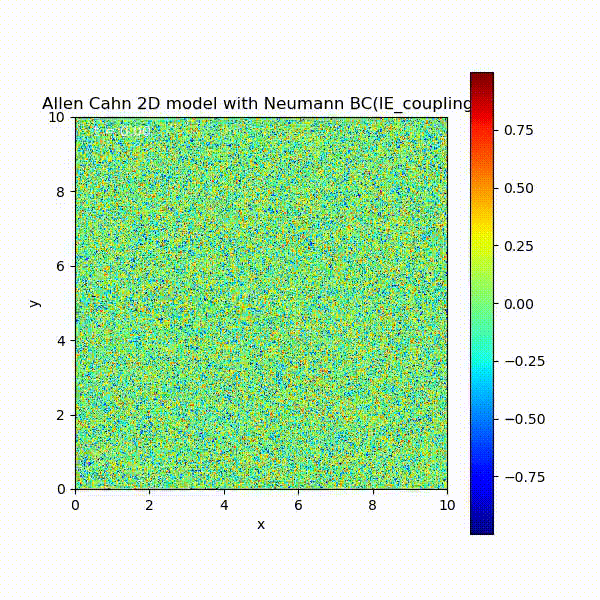
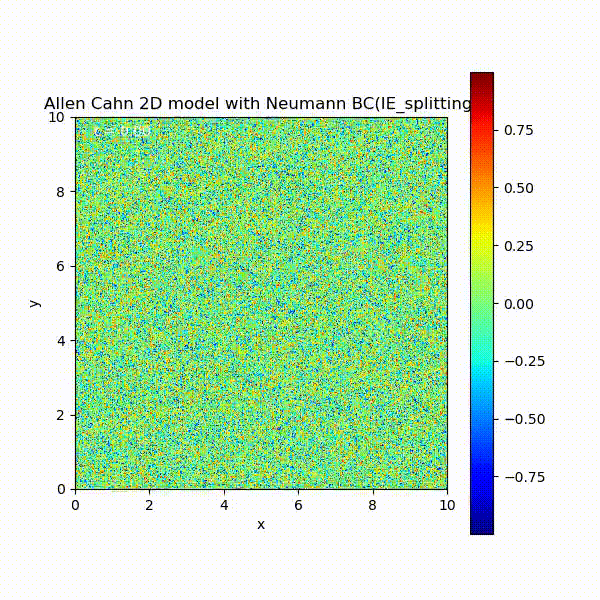
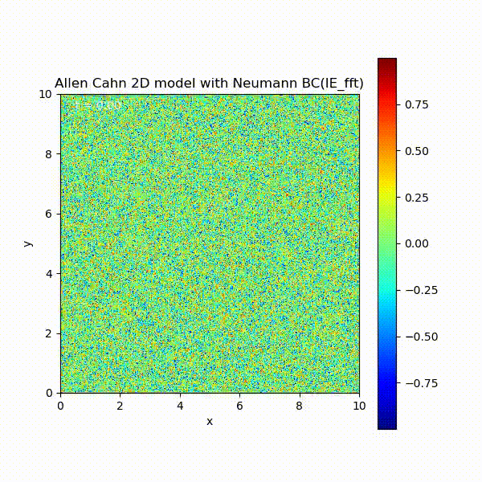

# nurmical PDE @NTU 2023 spring

This repository is class projects for numerical PDE.

## Project 1: ozone photo-chemistry problem(stiff ODE)

This project studies the ozone photo-chemistry problem. This is a stiff ODE (Ordinary Differential Equation). The following chemical reaction is from atmospheric science. The reaction involves oxygen (O), nitrogen oxides (NO, NO₂), and O₃:
```math
    NO_{2} + h\nu  \overset{k_{1}}{\rightarrow}NO+O 
```

```math
    O + O_{2}      \overset{k_{2}}{\rightarrow}O_{3} \\
```

```math

    NO + O_{3}     \overset{k_{2}}{\rightarrow}O_{2} + NO_{2}
```
Here, $hν$ denotes a photon of solar radiation. Let $c_{1}, ..., c_{4}$ be the concentrations of O, NO, NO₂, and O₃, respectively. The reaction system is
```math
    \dot{c_{1}} = k_{1}c_{3} - k_{2}c_{1} \\
```
```math
    \dot{c_{2}} = k_{1}c_{3} - k_{3}c_{2}c_{4} \\
```
```math
    \dot{c_{3}} = k_{3}c_{2}c_{4} - k_{1}c_{3} \\
```
```math
    \dot{c_{4}} = k_{2}c_{1} - k_{3}c_{2}c_{4}
```

```math
k_{1} = 10^{-2}max[0, sin(2\pi t/t_{d})]s^{-1}, t_{d} \text{ the length of 1 day,} \\
```

```math
k_{2} = 10^{5}s^{-1},   k_{3} = 10^{-16}  cm^{3} molecule^{-1}s^{-1}
```

## Project 1': study behaviors of various ODE solvers


## Project 2: 2D Allen-Cahn Model Simulation with Neumann Boundary Conditions

This project provides code for simulating a 2D Allen-Cahn model with Neumann boundary conditions. The implementation uses splitting, coupling, and Fast Fourier Transform (FFT) with periodic boundary conditions.

- Neumann boundary conditions with coupling diffusion term and reaction term

<div style="text-align: center">
    
</div>  


- Neumann boundary conditions with splitting method

<div style="text-align: center">
    
</div>


- FFT with periodic boundary conditions
    
<div style="text-align: center">
    
</div>


