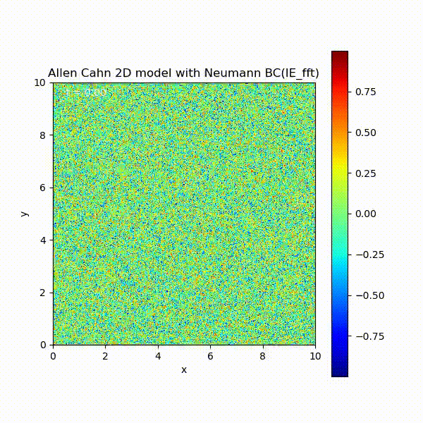

## Project 2: 2D Allen-Cahn Model Simulation with Neumann Boundary Conditions

This project provides code for simulating a 2D Allen-Cahn model with Neumann boundary conditions. The implementation uses splitting, coupling, and Fast Fourier Transform (FFT) with periodic boundary conditions.
The Allen-Cahn equation is a partial differential equation that describes the evolution of a phase field, and it is given by:

```math
\frac{\partial u}{\partial t} = \varepsilon \Delta u - \frac{1}{\varepsilon} W'(u)
```

```math
W(u) = \frac{1}{4}(u^2 - 1)^2
```

where `u(x, t)` is a pseudo time-dependent spatial variable, and `ε` is a small positive parameter. `Δ` denotes the Laplacian operator, and `W'(u)` is the derivative of a double-well potential function.


- Neumann boundary conditions with coupling diffusion term and reaction term

<div style="text-align: center">
    
</div>

- Neumann boundary conditions with splitting method

<div style="text-align: center">
    
</div>

- FFT with periodic boundary conditions

<div style="text-align: center">
    
</div>
